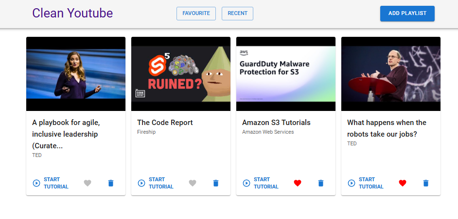
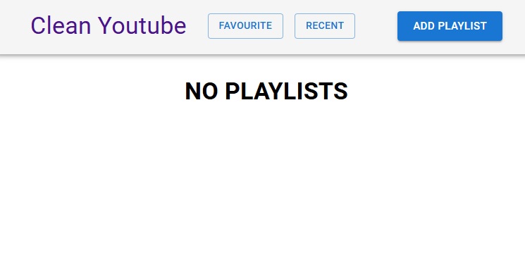
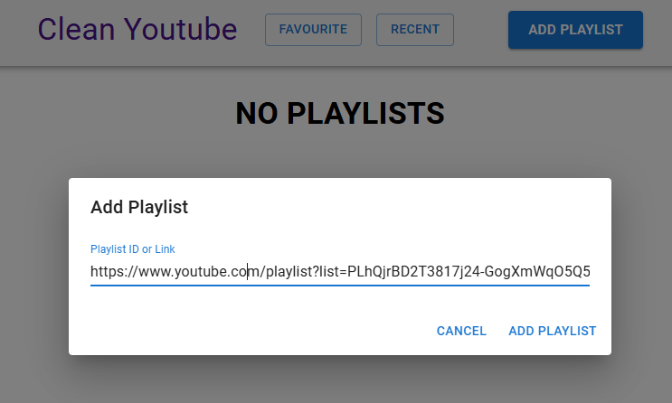
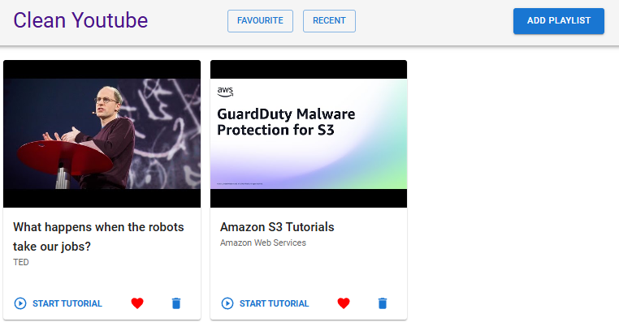
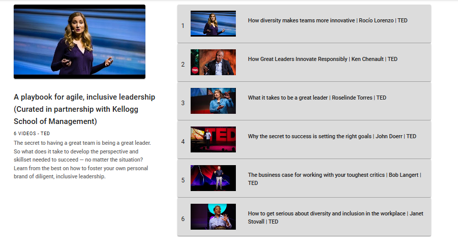
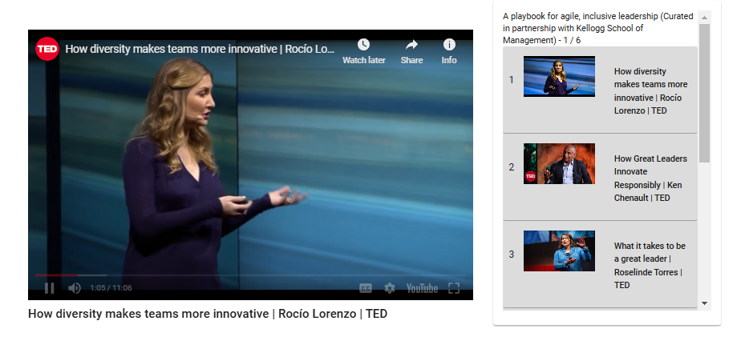

# 🎬 Clean YouTube

Welcome to **Clean YouTube**! This web application allows users to easily view YouTube playlists without distractions. Simply paste a YouTube playlist ID or link, and enjoy a clean viewing experience that focuses solely on your selected videos. You can also save your favorite playlists for quick access!

   

**Live Demo:** [cleanyotv.netlify.app](https://cleanyotv.netlify.app/)

## 📋 Overview

**Clean YouTube** provides a distraction-free interface for enjoying YouTube playlists. It aims to enhance the viewing experience by eliminating unnecessary elements from the YouTube interface, allowing users to focus on their favorite videos.

## 📋 Features

- **Distraction-Free Viewing:** Watch entire playlists without the clutter of unrelated videos.
- **Playlist Management:** Save your favorite playlists for easy access anytime.
- **Simple Interface:** A user-friendly design that makes it easy to navigate and enjoy your videos.

## 🖼️ Screenshots

   
   
   
   
   
   

## 🚀 Technology Stack

- **Frontend:** Material UI
- **Framework:** React (or any other relevant framework)
- **Other:** Youtube API, Custom-hook, Axios
- **Deployment:** Netlify

## ⚙️ How It Works

1. **Input the Playlist ID or Link:** Users can paste the YouTube playlist ID or URL into the input field.
2. **Fetch Playlist Data:** The application retrieves the playlist data using the YouTube API.
3. **Display Videos:** Videos from the playlist are displayed in a clean layout, free from distractions.
4. **Favorite Playlists:** Users can save their preferred playlists for quick access in the future.
